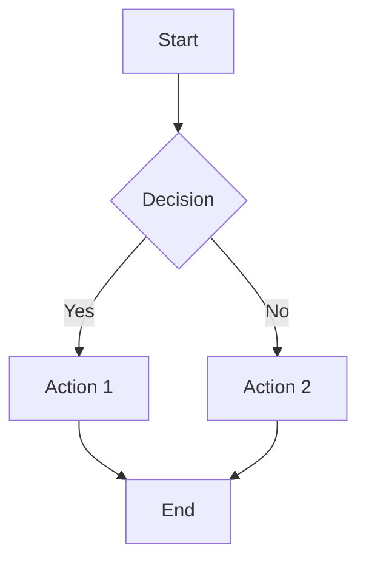
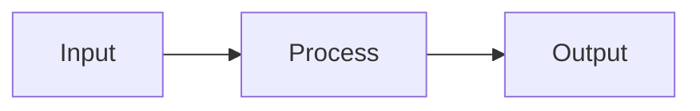
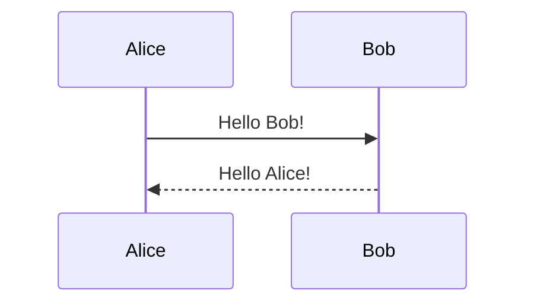

# Mermaider.nvim


A Neovim plugin for rendering [Mermaid.js](https://mermaid.js.org/) diagrams directly in your editor using [image.nvim](https://github.com/3rd/image.nvim).

## Features

- **Auto-rendering** - Diagrams render automatically on save or when opening files
- **Smart caching** - Avoids re-rendering unchanged diagrams for better performance
- **Multiple display modes** - Choose between inline rendering or split window view
- **Markdown support** - Render mermaid code blocks in `.md` files
- **Visual selection** - Render selected text as a diagram
- **Custom styling** - Apply your own CSS and configuration
- **Helpful error messages** - Clear feedback when diagrams fail to render
- **Terminal integration** - Works with Kitty, WezTerm, and other terminals via image.nvim

## Requirements

- **Neovim** 0.8+ (for `vim.uv` support)
- **Node.js and npm** (for mermaid-cli via npx)
- **[image.nvim](https://github.com/3rd/image.nvim)** - For displaying images in terminal
- **ImageMagick** - Required by image.nvim for image processing
  - macOS: `brew install imagemagick`
  - Ubuntu/Debian: `sudo apt-get install imagemagick`
  - Arch: `sudo pacman -S imagemagick`

## Installation

### Using [lazy.nvim](https://github.com/folke/lazy.nvim)

```lua
-- lua/plugins/mermaider.lua
{
  "snrogers/mermaider.nvim",
  dependencies = {
    "3rd/image.nvim", -- Required for image display
  },
  config = function()
    require("mermaider").setup({
      -- Configuration options (see below)
    })
  end,
  ft = { "mmd", "mermaid", "markdown" }, -- Load for these file types
}
```

### Using [packer.nvim](https://github.com/wbthomason/packer.nvim)

```lua
use {
  "snrogers/mermaider.nvim",
  requires = { "3rd/image.nvim" },
  config = function()
    require("mermaider").setup()
  end,
  ft = { "mmd", "mermaid", "markdown" },
}
```

## Quick Start

1. Install the plugin and dependencies
2. Open a `.mmd` file or create a markdown file with mermaid blocks
3. The diagram will render automatically
4. Use `:MermaiderRender` to manually render
5. Press `<leader>mt` to toggle between code and diagram view

## Configuration

### Basic Configuration

```lua
require("mermaider").setup({
  -- Display mode
  inline_render = true,        -- true = inline, false = split window
  
  -- Auto-rendering
  auto_render = true,          -- Render on save
  auto_render_on_open = true,  -- Render when opening files
  
  -- Styling
  theme = "forest",            -- "dark", "light", "forest", "neutral"
  background_color = "#1e1e2e",
})
```

### Complete Configuration

```lua
require("mermaider").setup({
  -- Mermaid CLI command
  mermaider_cmd = 'npx -y -p @mermaid-js/mermaid-cli mmdc -i {{IN_FILE}} -o {{OUT_FILE}}.png -s 3',
  
  -- File locations
  temp_dir = vim.fn.expand('$HOME/.cache/mermaider'),
  
  -- Auto-rendering behavior
  auto_render = true,                    -- Auto render on save
  auto_render_on_open = true,            -- Auto render when opening files
  auto_preview = true,                   -- Auto show preview after render
  throttle_delay = 500,                  -- Throttle auto-render (ms)
  
  -- Display settings
  inline_render = true,                  -- Inline vs split window
  max_width_window_percentage = 80,      -- Max image width (% of window)
  max_height_window_percentage = 80,     -- Max image height (% of window)
  
  -- Split window settings (when inline_render = false)
  split_direction = "vertical",          -- "vertical" or "horizontal"
  split_width = 50,                      -- Split width percentage
  
  -- Mermaid styling
  theme = "forest",                      -- Mermaid theme
  background_color = "#1e1e2e",          -- Background color
  mmdc_options = "",                     -- Additional CLI options
  
  -- Custom files
  css_file = nil,                        -- Path to custom CSS
  mermaid_config_file = nil,             -- Path to mermaid config JSON
})
```

## Usage

### File Types

The plugin works with:
- **`.mmd` and `.mermaid` files** - Renders the entire file
- **`.md` and `.markdown` files** - Renders mermaid code blocks

### Commands

#### Essential Commands
- `:MermaidRender` - Render current diagram
- `:MermaidPreview` - Preview rendered diagram
- `:MermaidToggle` - Toggle code/diagram view

#### Markdown Commands
- `:MermaidRenderBlock` - Render block at cursor
- `:MermaidRenderAllBlocks` - Render all blocks
- `:MermaidRenderSelection` - Render visual selection

#### Cache Management
- `:MermaidCacheClear` - Clear all cached renders
- `:MermaidCacheStats` - Show cache statistics

### Keybindings

Default keybindings:
- `<leader>mt` - Toggle code/diagram view (normal mode)
- `<leader>mr` - Render visual selection (visual mode)

### Examples

#### Basic Mermaid File (.mmd)


#### Markdown with Mermaid Blocks
````markdown
# My Documentation

Here's a flow diagram:



And here's a sequence diagram:


````

## Display Modes

### Inline Rendering (Default)
- Displays diagram directly in the buffer
- Toggle between code and diagram with `<leader>mt`
- Non-intrusive - doesn't modify your files

### Split Window Rendering
```lua
require("mermaider").setup({
  inline_render = false,
  split_direction = "vertical", -- or "horizontal"
  split_width = 50,
})
```
- Shows diagram in a separate split window
- Side-by-side editing experience
- Guaranteed not to modify your files

## Custom Styling

### Using CSS Files
```lua
require("mermaider").setup({
  css_file = "~/.config/nvim/mermaid-custom.css",
})
```

### Using Mermaid Config
```lua
require("mermaider").setup({
  mermaid_config_file = "~/.config/nvim/mermaid-config.json",
})
```

See the `examples/` directory for sample CSS and config files.

## Performance Features

### Smart Caching
- Diagrams are cached based on content hash
- Only re-renders when content actually changes
- Dramatically faster for large files with frequent saves

### Throttled Auto-Rendering
- Auto-render is throttled to prevent excessive rendering
- Configurable delay (default: 500ms)

## Troubleshooting

### Common Issues

**Images not displaying:**
- Ensure image.nvim is properly configured for your terminal
- Check that ImageMagick is installed
- Verify you're using a supported terminal (Kitty, WezTerm, etc.)

**Mermaid CLI errors:**
- Run `npx -y -p @mermaid-js/mermaid-cli mmdc --help` to test CLI
- Check your diagram syntax at [mermaid.live](https://mermaid.live)

**File modifications with inline render:**
- Switch to split mode: `inline_render = false`
- This guarantees no file modifications

### Debug Commands
- `:messages` - View recent plugin messages
- `:MermaidCacheStats` - Check cache status
- `:checkhealth mermaider` - Run health checks (if implemented)

## Contributing

Contributions are welcome! Please see [CONTRIBUTING.md](docs/CONTRIBUTING.md) for guidelines.

## License

MIT License - see [LICENSE](LICENSE) for details.

## Acknowledgments

- [Mermaid.js](https://mermaid.js.org/) - The amazing diagramming library
- [image.nvim](https://github.com/3rd/image.nvim) - Terminal image display
- The Neovim community for inspiration and support