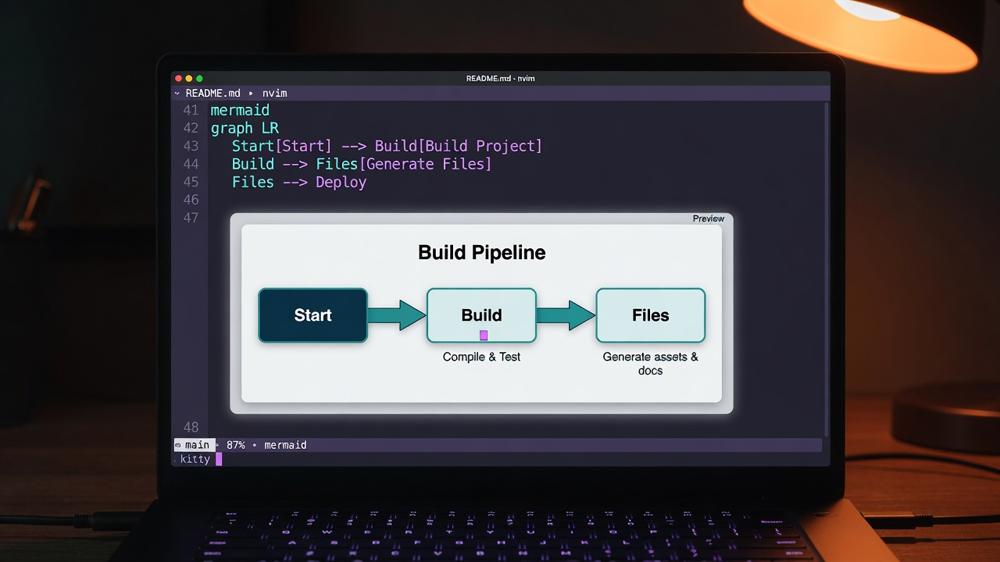
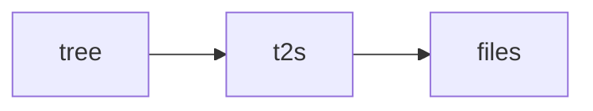

<p align="center">
  
</p>

# mermaider.nvim

**Mermaid diagrams, in the buffer, not in a browser tab.**

A Neovim plugin that runs [mermaid-cli](https://github.com/mermaid-js/mermaid-cli)
and shows the PNG through [image.nvim](https://github.com/3rd/image.nvim).
`.mmd` files and ` ```mermaid ` blocks in markdown. Renders on save.
Caches by content hash.

Kitty and WezTerm work. Your terminal has to speak images.

## Install

[lazy.nvim](https://github.com/folke/lazy.nvim):

```lua
{
  "lancekrogers/mermaider.nvim",
  dependencies = { "3rd/image.nvim" },
  ft = { "mmd", "mermaid", "markdown" },
  config = function()
    require("mermaider").setup()
  end,
}
```

Needs Neovim 0.8+, Node (for `npx … mermaid-cli`), ImageMagick, and a
working `image.nvim` setup.

```bash
brew install imagemagick          # macOS
sudo apt-get install imagemagick  # Debian
```

## Use

1. Open a `.mmd` file or a markdown fence.
2. Save. The diagram should appear.
3. `:MermaidToggle` or `<leader>mt` flips code ↔ image.
4. `:MermaidRender` if you want it now.


```mermaid
flowchart LR
    A[tree] --> B[t2s]
    B --> C[files]
```

## Config

```lua
require("mermaider").setup({
  mermaider_cmd = 'npx -y -p @mermaid-js/mermaid-cli mmdc -i {{IN_FILE}} -o {{OUT_FILE}}.png -s 3',
  temp_dir = vim.fn.expand('$HOME/.cache/mermaider'),
  auto_render = true,
  auto_render_on_open = true,
  auto_preview = true,
  throttle_delay = 500,
  inline_render = true,           -- false = split
  split_direction = "vertical",
  split_width = 50,
  theme = "forest",               -- dark | light | forest | neutral
  background_color = "#1e1e2e",
  css_file = nil,
  mermaid_config_file = nil,
})
```

Commands: `:MermaidRender`, `:MermaidPreview`, `:MermaidToggle`,
`:MermaidRenderBlock`, `:MermaidRenderAllBlocks`,
`:MermaidRenderSelection`, `:MermaidCacheClear`, `:MermaidCacheStats`.

`examples/` has sample CSS and `mermaid.config.json`.

## When it is blank

- `image.nvim` not configured for this terminal
- ImageMagick missing
- `npx -y -p @mermaid-js/mermaid-cli mmdc --help` fails
- Bad Mermaid: check [mermaid.live](https://mermaid.live)

`:messages` and `:MermaidCacheStats` are the first two places to look.

## License

[MIT](LICENSE)
