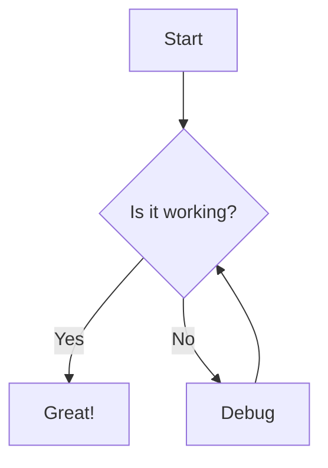
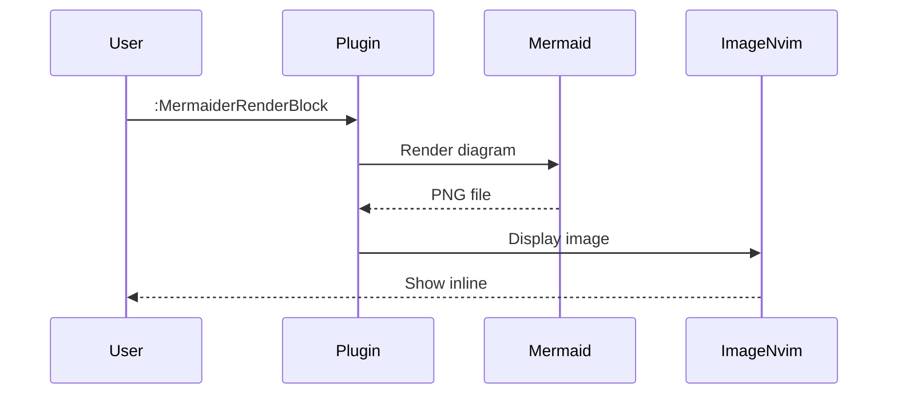
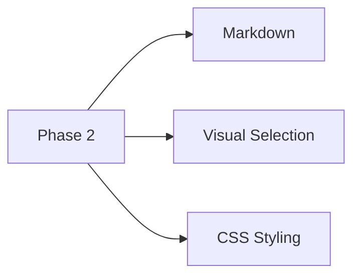
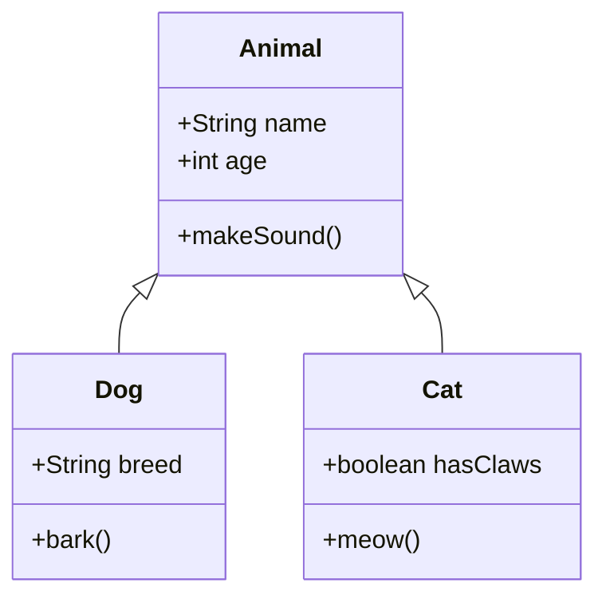

# Test Markdown with Mermaid Blocks

This file tests the markdown integration feature of mermaider.nvim.

## Simple Flowchart

Here's a basic flowchart:



## Sequence Diagram

This demonstrates a sequence diagram:



## Multiple Diagrams

You can have multiple diagrams in one file:



## Testing Visual Selection

Select the lines below and use `<leader>mr` to render just the selection:

graph TD
    VS[Visual Selection] --> R[Render]
    R --> P[Preview]

## Non-Mermaid Code Blocks

This shouldn't be processed:

```javascript
// This is JavaScript, not mermaid
function hello() {
    console.log("Hello, world!");
}
```

## Class Diagram with Custom Styling

When using custom CSS, this should look different:

