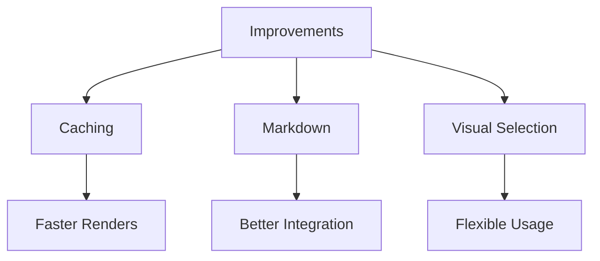

# Testing Phase 1 & 2 Improvements

## Phase 1 Benefits to Test:

### 1. Content-Based Caching
- Edit this file and save multiple times without changing the diagram
- The second save should be instant (check messages for "Using cached render")
- Run `:MermaiderCacheStats` to see cache info

### 2. Better Error Messages
- Try the error test file: `nvim test/test_error.mmd`
- Should see helpful error messages instead of raw mermaid output

### 3. No More Path Collisions
- Create same-named files in different directories
- Each should render to its own cached file

## Phase 2 Benefits to Test:

### 1. Markdown Support
Below is a mermaid diagram in markdown:

### 2. Visual Selection
Select these lines and press `<leader>mr`:
graph LR
    Start --> Middle
    Middle --> End

### 3. Commands
- `:messages` - Check for cache hits
- `:MermaiderCacheStats` - See cache statistics
- `:MermaiderRenderBlock` - Render just the block above